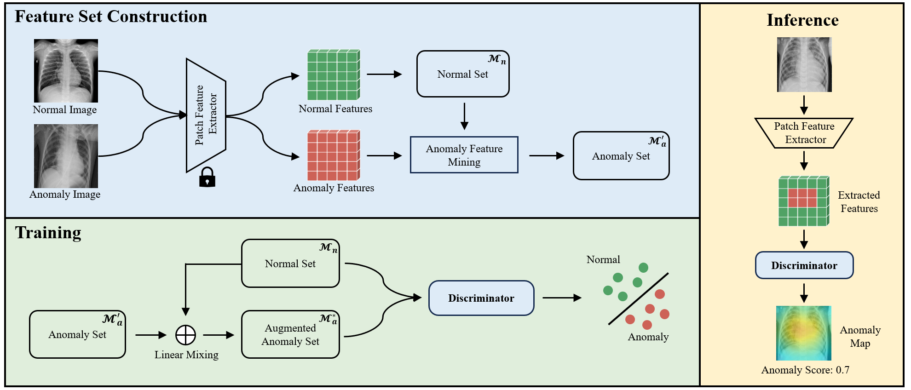
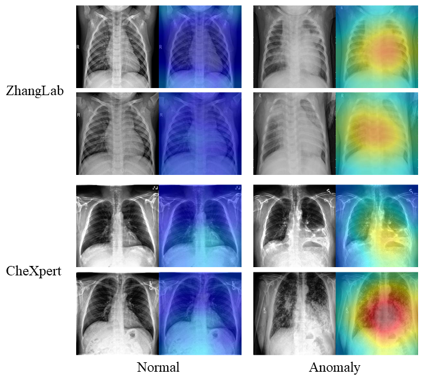

# WSCXR

**💡 This is the official implementation of the paper "Weakly Supervised Anomaly Detection for Chest X-Ray Image"**.  


WSCXR is a weakly supervised anomaly detection framework for Chest X-Ray (CXR) image. WSCXR can effectively leverage medical cues from few-shot real anomalous images for anomaly detection, thereby improving the model’s anomaly detection performance. Additionally, WSCXR employs a linear mixing strategy to augment the anomaly features, facilitating the training of anomaly detector with few-shot anomaly images. 

<div align=center></div>  

## 🔧 Installation

To run experiments, first clone the repository and install `requirements.txt`.

```
$ git clone https://github.com/IamCuriosity/WSCXR.git
$ cd WSCXR
$ pip install -r requirements.txt
```  
### Data preparation 
Download the following datasets:
- **ZhangLab  [[Baidu Cloud]](https://pan.baidu.com/s/1ZVm3qHcSpXel5Zk0CDbHQA?pwd=dxed) or [[Google Drive]](https://drive.google.com/file/d/17hAUZXskqd3eVc-ZRkgfn1Rd2HoP6izh/view?usp=sharing)**  
- **CheXpert [[Baidu Cloud]](https://pan.baidu.com/s/1s__UjdSHS6LnYmITSBuMGA?pwd=v8lg) or [[Google Drive]](https://drive.google.com/file/d/14F4DNFUAGdxPKToIuX-ytY0gft2nn8d-/view?usp=sharing)**  

Unzip them to the `data`. Please refer to [data/README](data/README.md).  
  
## 🚀 Experiments

To train the WSCXR on the ZhangLab dataset:  
```
$ python  train.py --dataset_name zhanglab  
```  
   
To test the WSCXR on the ZhangLab dataset:  
```
$ python  test.py --dataset_name zhanglab  
```  

<div align=center></div>  

## 🔗 Citation  

If this work is helpful to you, please cite it as:
```
coming soon.
```
